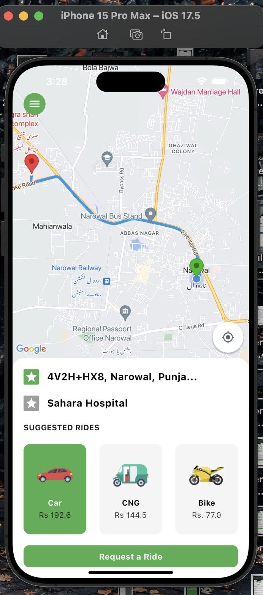
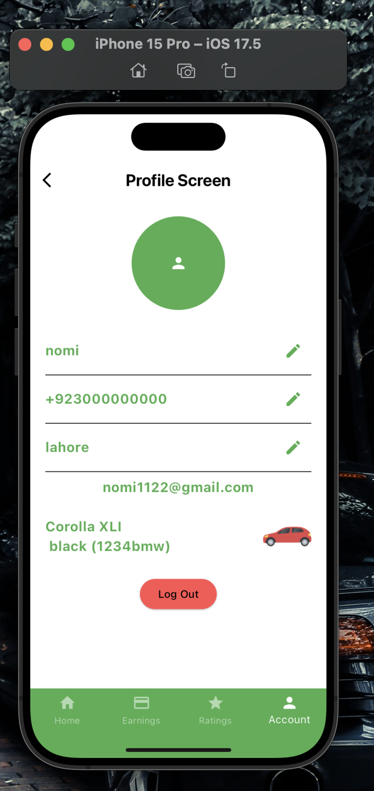

# Navigo On Drivers

Navigo On Drivers is a Flutter application designed to function similarly to Uber, providing drivers with the ability to manage rides, track earnings, and interact with passengers. This app is part of the Navigo suite, aimed at creating a seamless ride-hailing experience.

## Features

- **Driver Registration and Authentication**: Secure sign-up and login using Firebase Authentication.
- **Ride Requests**: Accept or reject ride requests from passengers.
- **Real-time Location Tracking**: Track passenger pick-up and drop-off locations using real-time GPS.
- **Ride Management**: Manage ongoing rides, view ride history, and track earnings.
- **Push Notifications**: Receive instant notifications for ride requests and updates.
- **User Profile**: Manage and update driver profile details.

## Tech Stack

- **Frontend**: Flutter, Dart
- **Backend**: Firebase (Authentication, Firestore, Realtime Database)
- **APIs**: Google Maps API for location tracking and routing

## Installation

To run this project locally, follow these steps:

1. **Clone the repository**:
    ```sh
    git clone https://github.com/yourusername/navigo_on_drivers.git
    cd navigo_on_drivers
    ```

2. **Install dependencies**:
    ```sh
    flutter pub get
    ```

3. **Configure Firebase**:
    - Set up a Firebase project at [Firebase Console](https://console.firebase.google.com/).
    - Enable Firebase Authentication and Firestore Database.
    - Download the `google-services.json` file for Android and `GoogleService-Info.plist` file for iOS.
    - Place these files in the respective directories in your Flutter project:
        - `android/app/google-services.json`
        - `ios/Runner/GoogleService-Info.plist`

4. **Run the app**:
    ```sh
    flutter run
    ```

## Usage

- **Sign Up/Login**: Register as a driver or log in with existing credentials.
- **Manage Rides**: Accept ride requests, navigate to pick-up and drop-off points, and complete rides.
- **Track Earnings**: View ride history and track earnings.

## Screenshots





## Contributing

Contributions are welcome! Please fork the repository and submit a pull request with your changes.

## License

This project is licensed under the MIT License. See the [LICENSE](LICENSE) file for details.

## Contact

For any inquiries or support, please contact:

- **Name**: Ahsan Raza
- **Email**: [ahsan.dox@gmail.com](mailto:ahsan.dox@gmail.com)
---

Thank you for using Navigo On Drivers! Safe driving!